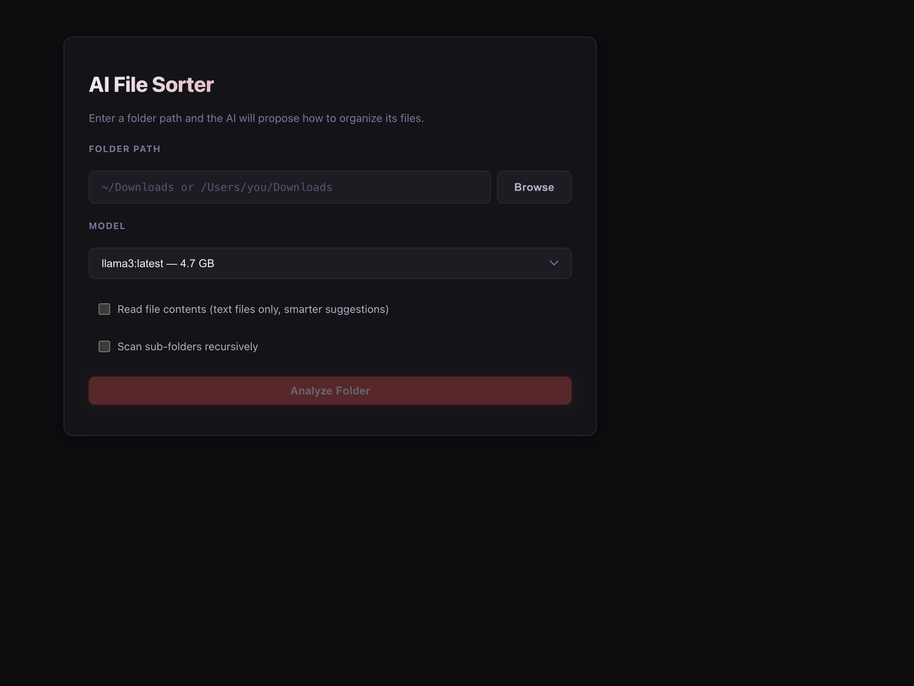
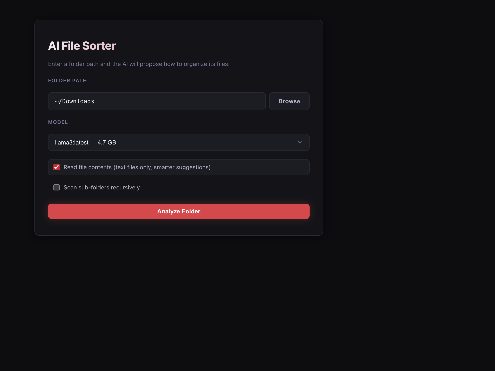
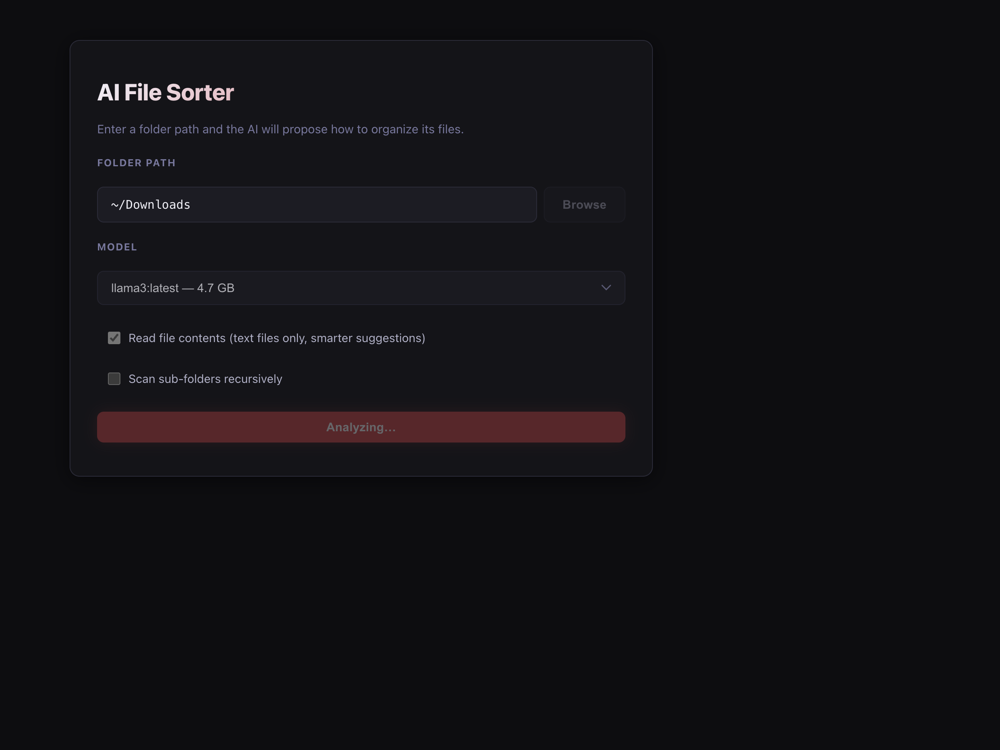
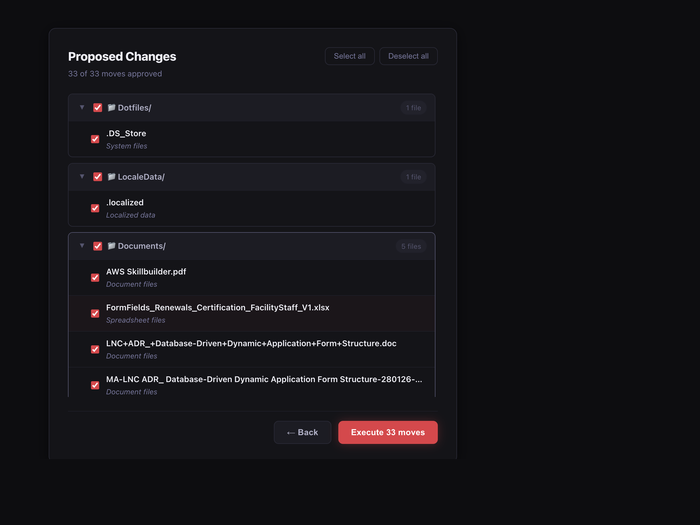
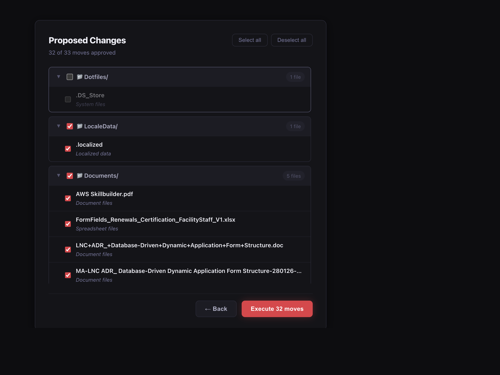
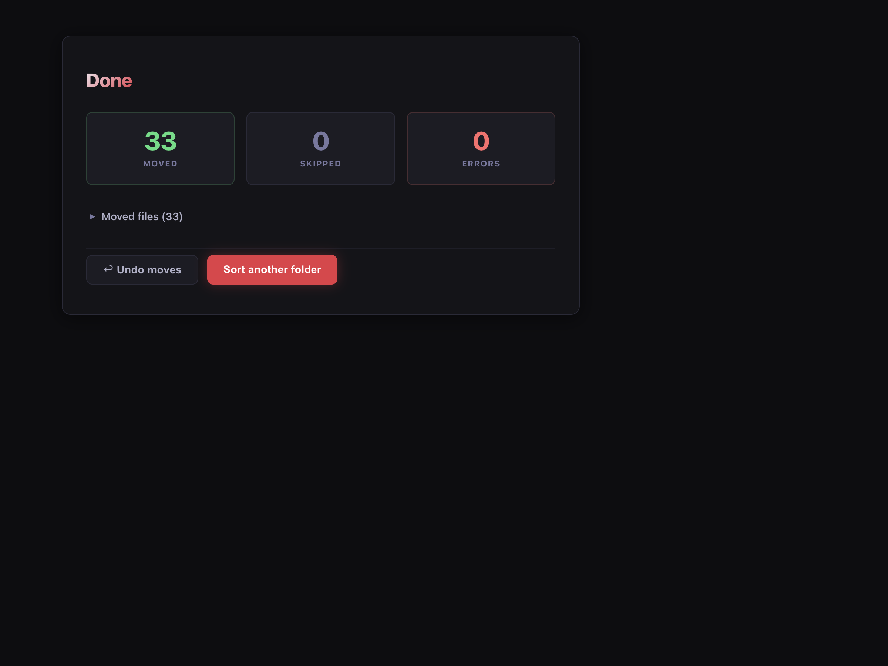
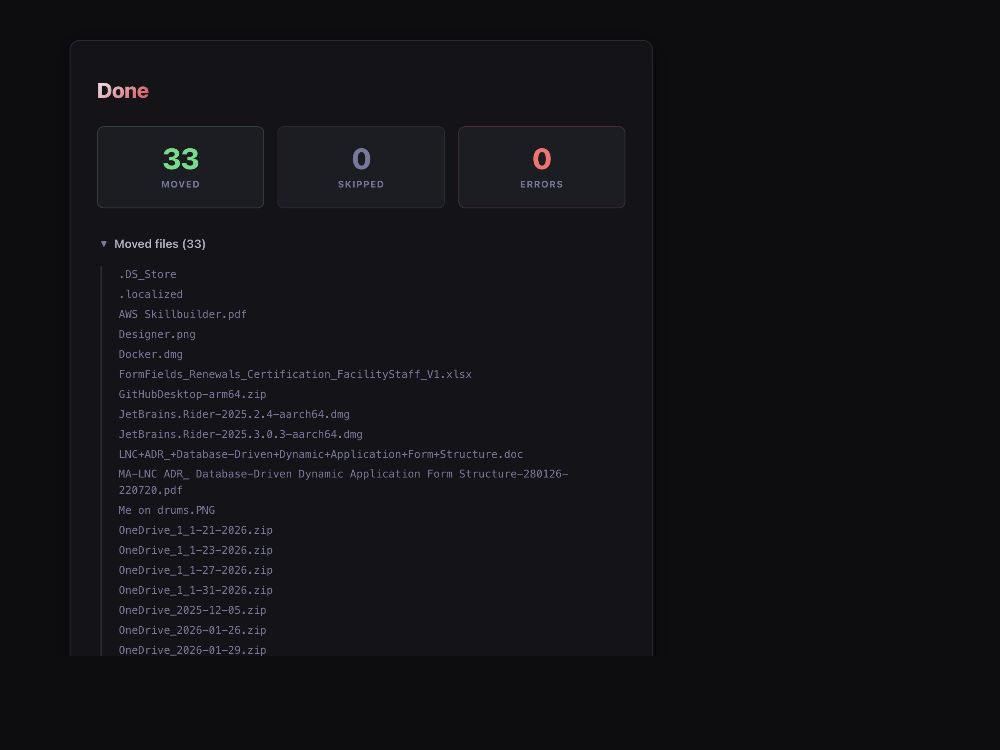

# AI File Sorter

An AI-powered desktop app that analyzes a folder on your machine and proposes an intelligent organization plan — grouping files by type, date, or context using a local LLM (via [Ollama](https://ollama.com/)). No data leaves your machine.



---

## Features

- **Local AI inference** — runs entirely on your machine via Ollama; nothing is sent to the cloud
- **Smart proposals** — the LLM reads filenames (and optionally file contents) to produce meaningful folder groupings with reasons
- **Review before you move** — every proposed move is shown in a tree view; approve or reject individual files or entire folders
- **Batch processing** — handles large directories by chunking files (50 at a time) with automatic LLM retry on malformed responses
- **Recursive scanning** — optionally scan sub-folders as well as the top-level directory
- **Conflict handling** — if a destination file already exists, the app auto-renames (`file (1).pdf`, `file (2).pdf`, …)
- **Undo / rollback** — every execute session is logged; a single click reverses all moves
- **Model picker** — choose any Ollama model installed on your machine from the UI
- **Native folder picker** — Browse button uses the browser's File System Access API (Chromium)

---

## Screenshots

### Step 1 — Configure

Enter a folder path manually or click **Browse** to pick it from the OS. Choose your Ollama model, toggle content-reading and recursive scan options, then click **Analyze Folder**.



---

### Step 2 — Analyzing

The app scans the directory, sends filenames (and optional file snippets) to the LLM, and streams back structured JSON proposals.



---

### Step 3 — Review Proposals

Files are grouped into destination folders. Each group is collapsible. Use the folder-level checkbox to approve or reject an entire group, or toggle individual files. The header shows a live count of approved moves.



Deselect folders you don't want moved:



---

### Step 4 — Results

After executing, a summary shows how many files were moved, skipped, or errored. Expand the detail sections to see the full file list. Use **↩ Undo moves** to reverse everything in one click.





---

## Architecture

```
file-sorter/
├── backend/                  # FastAPI + Python 3.13
│   ├── main.py               # App entry point
│   ├── requirements.txt
│   ├── Dockerfile
│   └── src/
│       ├── types.py           # Pydantic request/response models
│       ├── routes/
│       │   ├── health.py      # GET /health, GET /api/models
│       │   └── sort.py        # POST /api/sort/analyze|execute|undo
│       └── lib/
│           ├── file_scanner.py    # Directory scan with optional content reading
│           ├── ollama_provider.py # LLM calls, batching, retry, model listing
│           └── file_mover.py      # File moves, conflict resolution, undo history
├── frontend/                 # React + TypeScript + Vite
│   └── src/
│       ├── App.tsx            # 3-step state machine (input → proposal → result)
│       ├── components/
│       │   ├── FolderInput.tsx    # Step 1: path input, model picker, options
│       │   ├── ProposalView.tsx   # Step 2: tree view with approve/reject
│       │   └── ResultView.tsx     # Step 3: stats, file list, undo
│       └── services/
│           └── sortApi.ts         # API client (all backend calls)
├── docker-compose.yml
└── TODO.md
```

**Data flow:**

```
Browser → POST /api/sort/analyze → file_scanner → ollama_provider → LLM (Ollama)
                                                         ↓
Browser ← SortProposal (JSON) ← proposed moves ←────────┘

Browser → POST /api/sort/execute → file_mover → moves files on disk → session logged
Browser → POST /api/sort/undo   → file_mover → reverses logged session
```

---

## Prerequisites

| Requirement | Version | Notes |
|---|---|---|
| Python | 3.13 | 3.14 not yet supported (pydantic-core wheel missing) |
| Node.js | 18+ | For frontend |
| Ollama | Latest | [Install guide](https://ollama.com/download) |
| A pulled model | e.g. `llama3` | See below |

---

## Setup & Installation

### 1. Install Ollama and pull a model

```bash
# macOS
brew install ollama
brew services start ollama

# Pull a model (llama3 recommended, ~4.7 GB)
ollama pull llama3
```

Ollama runs at `http://localhost:11434` by default.

### 2. Clone the repo

```bash
git clone https://github.com/rajatgedam/ai-file-sorter.git
cd ai-file-sorter
```

### 3. Backend

```bash
cd backend

# Create a virtual environment with Python 3.13
python3.13 -m venv .venv
source .venv/bin/activate          # Windows: .venv\Scripts\activate

# Install dependencies
pip install -r requirements.txt

# Start the server (port 8001)
uvicorn main:app --host 0.0.0.0 --port 8001 --reload
```

The API will be available at `http://localhost:8001`.  
Interactive docs: `http://localhost:8001/docs`

### 4. Frontend

```bash
# In a new terminal, from the repo root
cd frontend

npm install
npm run dev
```

The UI will be available at `http://localhost:5173`.

---

## Environment Variables

### Backend

| Variable | Default | Description |
|---|---|---|
| `OLLAMA_HOST` | `http://localhost:11434` | Ollama server URL |
| `OLLAMA_MODEL` | `llama3` | Default model to use for proposals |
| `CORS_ORIGIN` | `http://localhost:5173` | Allowed frontend origin |
| `HISTORY_FILE` | `~/.ai-file-sorter/history.json` | Path to undo history log |

Copy `.env.example` to `.env` and edit as needed:

```bash
cp backend/.env.example backend/.env
```

### Frontend

| Variable | Default | Description |
|---|---|---|
| `VITE_API_BASE_URL` | `http://localhost:8001` | Backend API base URL |

---

## Running with Docker

```bash
# From the repo root
docker-compose up --build
```

> **Note:** Ollama must be running natively on the host. The compose file sets `OLLAMA_HOST=http://host.docker.internal:11434` so the container can reach it.

---

## API Reference

### `GET /health`

Returns backend and Ollama connection status.

```json
{
  "status": "ok",
  "ollama_connected": true,
  "ollama_host": "http://localhost:11434"
}
```

### `GET /api/models`

Returns all locally available Ollama models.

```json
{
  "models": [
    { "name": "llama3:latest", "size": 4661224676 }
  ]
}
```

### `POST /api/sort/analyze`

Scans a folder and returns AI-proposed moves. **Dry-run only — nothing is moved.**

**Request:**
```json
{
  "folder_path": "~/Downloads",
  "include_content": false,
  "recursive": false
}
```

**Response:**
```json
{
  "moves": [
    {
      "source": "/Users/you/Downloads/report.pdf",
      "destination": "/Users/you/Downloads/Documents/report.pdf",
      "reason": "PDF document, grouped with other documents",
      "approved": true
    }
  ]
}
```

### `POST /api/sort/execute`

Executes approved moves from a prior analyze call.

**Request:**
```json
{
  "folder_path": "~/Downloads",
  "moves": [ /* array of ProposedMove objects with approved: true/false */ ]
}
```

**Response:**
```json
{
  "moved": ["/Users/you/Downloads/Documents/report.pdf"],
  "skipped": [],
  "errors": [],
  "session_id": "a3f9c21b-..."
}
```

### `POST /api/sort/undo`

Reverses all moves from a prior execute session.

**Request:**
```json
{ "session_id": "a3f9c21b-..." }
```

**Response:** Same shape as `/execute` (the reverse moves).

---

## Running Tests

```bash
cd backend
source .venv/bin/activate
pytest tests/ -v --cov=src --cov-report=term-missing
```

Current status: **37 tests, 95% coverage.**

Test classes:
- `TestHealth` — health and models endpoints
- `TestAnalyze` — folder scanning and LLM proposal endpoint
- `TestExecute` — file move execution
- `TestFileScanner` — directory scanning, content reading, recursive mode
- `TestOllamaProvider` — LLM prompt construction and JSON parsing
- `TestRecursiveScanning` — nested directory handling
- `TestConflictHandling` — duplicate filename resolution
- `TestUndo` — session history and rollback
- `TestBatchAndRetry` — 50-file batching and malformed JSON retry
- `TestModelsEndpoint` — Ollama model listing

---

## How the AI Works

1. **Scan** — the backend lists all files in the target directory (with optional content snippets, first 200 chars for text files).
2. **Batch** — files are chunked into groups of 50 to stay within LLM context limits.
3. **Prompt** — each batch is sent to the LLM with a system prompt instructing it to return a JSON array of `{ source, destination, reason }` objects. All destination paths must stay inside the original folder (path traversal protection).
4. **Parse & retry** — if the LLM returns malformed JSON or wraps the response in markdown fences, the provider strips the fences and retries once with a correction prompt.
5. **Merge** — proposals from all batches are combined into a single `SortProposal`.

Example system prompt excerpt:
> *"You are a file organization assistant. Given a list of files, propose how to sort them into sub-folders... Return ONLY valid JSON, no explanation..."*

---

## Contributing

1. Fork the repo and create a feature branch.
2. Write a failing test first (TDD).
3. Implement the minimum code to pass.
4. Ensure `pytest` coverage stays ≥ 80% on changed files.
5. Open a pull request with a clear description.

---

## License

MIT — see [LICENSE](LICENSE).
